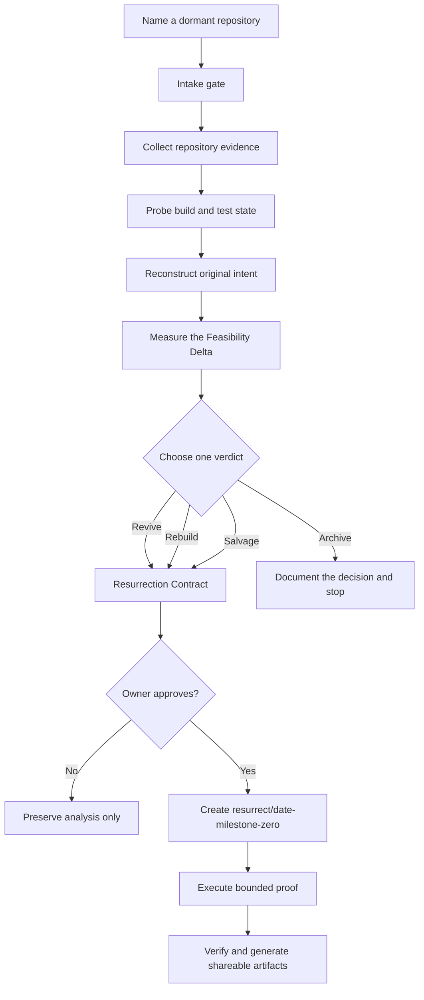

# Resurrect

[](https://github.com/dhruvtoprani/resurrect/actions/workflows/test.yml)
[](https://nodejs.org/)
[](#agent-skill)
[](LICENSE)

> **Turn abandoned repositories into evidence-backed product decisions, then prove the decision on a safe comeback branch.**

Resurrect is a local-first agent skill and CLI for developers who have old repositories with useful code, unfinished ideas, and no clear next move. It reconstructs the original product intent, diagnoses why progress stopped, measures what has become easier since then, and chooses one explicit verdict: **Revive, Rebuild, Salvage, or Archive**.

It does not stop at a report. After owner approval, Resurrect creates a dedicated comeback branch and prepares a bounded **Milestone Zero** that can prove whether the project deserves another life.

**Links:** [Workflow](#workflow) · [Generated artifacts](#generated-artifacts) · [Safety model](#safety-model) · [Agent skill](#agent-skill) · [Development](#development)

---

## The Problem

Old repositories are rarely just “unfinished.” They usually contain a mix of:

- a product idea that may still be valuable
- code that may or may not be recoverable
- hidden blockers, dead dependencies, or missing services
- abandoned branches and partially completed work
- context that exists only in commit history, issues, and the creator’s memory

A generic “finish this repo” prompt often sends an agent toward the most visible code instead of the most valuable outcome.

Resurrect creates a decision gate before execution:

> What is still worth preserving, what changed since the project stalled, and what is the smallest proof that could justify continuing?

---

## Who It Helps

- **Developers** deciding whether an old side project deserves another weekend
- **Founders** revisiting prototypes that were blocked by cost, timing, or missing infrastructure
- **Open-source maintainers** separating reusable assets from dead product scope
- **AI coding-tool users** who want evidence and boundaries before an agent starts rewriting a codebase

---

## Product Principles

1. **Evidence before inference**  
   Running behavior, source code, git history, issues, and tests outrank README claims or agent guesses.

2. **A verdict, not a vague score**  
   Every analysis ends in exactly one decision: Revive, Rebuild, Salvage, or Archive.

3. **Approval before execution**  
   Resurrect will not create a comeback branch until the owner approves the Resurrection Contract.

4. **Proof before ambition**  
   Milestone Zero is a bounded vertical slice, not a promise to autonomously finish the entire product.

---

## Workflow



### Evidence hierarchy

Resurrect ranks evidence in this order:

1. Running behavior and tests
2. Source code
3. Git, branch, pull-request, and commit history
4. Issues and planning documents
5. README and documentation claims
6. Agent inference

Major findings are written with stable citation IDs so another human or agent can trace the decision back to repository evidence.

---

## Verdicts

| Verdict | Use it when | What happens next |
| --- | --- | --- |
| **Revive** | The product direction and core architecture still make sense | Repair the earliest blocker and prove a narrow vertical slice |
| **Rebuild** | The idea is valuable, but the implementation should mostly be replaced | Preserve requirements and useful assets, then define a clean foundation |
| **Salvage** | The full product should end, but one component deserves to live | Extract the reusable library, dataset, workflow, model, or interface |
| **Archive** | No valuable outcome justifies more work | Record the evidence, rationale, and reusable lessons without executing |

Resurrect deliberately avoids fake “73% complete” estimates. It evaluates separate dimensions such as product clarity, technical recoverability, distinctive assets, current relevance, and weekend shipability.

---

## Generated Artifacts

```text
repository-root/
├── RESURRECTION.md
└── .resurrect/
    ├── EVIDENCE.json
    ├── INTENT_SIGNALS.json
    ├── AUTOPSY_CLASSIFICATION.json
    ├── CITATIONS.md
    ├── CITATIONS.json
    ├── AUTOPSY.md
    ├── ORIGINAL_INTENT.md
    ├── FEASIBILITY_DELTA.md
    ├── RESURRECTION_CONTRACT.md
    ├── EXECUTION_PLAN.md
    ├── CONTEXT.md
    ├── PR_SUMMARY.md
    ├── SHARE.md
    ├── badges/
    │   ├── verdict.svg
    │   ├── milestone-zero.svg
    │   └── branch.svg
    └── tasks/
        ├── 001-restore-environment.md
        ├── 002-remove-dead-scope.md
        ├── 003-build-vertical-slice.md
        └── 004-verify-and-deploy.md
```

`RESURRECTION.md` is the public decision story for humans. `.resurrect/` is the evidence archive and execution context for coding agents.

---

## Quick Start

### Prerequisites

- Node.js 22+
- Git
- GitHub CLI (`gh`) only for account-wide repository scanning

### Install from GitHub

```bash
npm install -g github:dhruvtoprani/resurrect
```

### Find dormant repositories

```bash
gh auth login
resurrect scan
```

The scanner ranks repositories using dormancy, product evidence, language signals, topics, and archive state. It shortlists candidates without cloning them.

### Start with a local project

```bash
resurrect path/to/old-project
```

The intake gate asks only three questions before deep analysis:

1. Do you want to ship the original idea, salvage one asset, modernize the stack, or decide whether to archive?
2. What do you remember as the reason you stopped?
3. What time budget should constrain Milestone Zero?

After answering:

```bash
resurrect path/to/old-project --confirmed
```

Review and approve `.resurrect/RESURRECTION_CONTRACT.md`, then execute from inside the target repository:

```bash
resurrect execute
```

Resurrect creates a new branch such as:

```text
resurrect/2026-07-23-milestone-zero
```

### Inspect a GitHub repository target

```bash
resurrect owner/repository
```

Remote targets currently receive a lightweight intake and metadata check. Deep analysis and execution require a local clone so the tool can inspect history, probe the build, and create a safe branch.

---

## Command Reference

| Command | Purpose |
| --- | --- |
| `resurrect demo` | Run the bundled end-to-end recovery fixture |
| `resurrect scan` | Rank dormant repositories in the authenticated GitHub account |
| `resurrect <project>` | Resolve the target and run the intake gate |
| `resurrect <project> --confirmed` | Collect evidence and generate the analysis scaffold |
| `resurrect execute` | Create the approved comeback branch and prepare Milestone Zero |
| `resurrect pr-summary` | Print a PR-ready summary from the latest evidence |

---

## Agent Skill

The same workflow can be used as a Codex or Claude Code skill.

- **Codex trigger:** `$resurrect`
- **Claude Code trigger:** `/resurrect`

Copy this repository into the relevant local skills directory as a folder named `resurrect`. The core operating contract lives in [`SKILL.md`](SKILL.md).

The division of responsibility is intentional:

- deterministic scripts collect evidence, probe the environment, classify common failure modes, and write artifacts
- the agent handles product judgment, owner dialogue, external feasibility research, and Milestone Zero implementation

---

## Safety Model

Resurrect treats unknown repositories as untrusted code and defaults to non-destructive behavior.

- Never modifies the default branch during diagnosis
- Never pushes automatically
- Never deletes branches
- Blocks execution until the owner approves the contract
- Refuses to execute from a detached HEAD
- Blocks dirty working trees unless changes are explicitly allowed
- Uses dependency-install safeguards and blocks lifecycle scripts by default
- Redacts likely secrets from captured command output
- Keeps generated evidence in `.resurrect/`

See [`SECURITY.md`](SECURITY.md) for the complete operating guidance.

---

## Architecture

| Layer | Responsibility |
| --- | --- |
| **Agent skill** | Intake, product reasoning, feasibility research, verdict selection, and bounded execution judgment |
| **CLI orchestrator** | Target resolution, workflow sequencing, approval gates, and comeback-branch creation |
| **Evidence collectors** | Git history, unfinished-work signals, repository metadata, citations, and intent signals |
| **Build probes** | Installation, build, test, and launch-state checks with conservative defaults |
| **Artifact generators** | Human-readable decision story, agent context, task files, PR summary, and badges |

### Repository layout

```text
.github/workflows/     CI test workflow
agents/                Agent interface metadata
assets/templates/      Generated contract and task templates
references/             Evidence rules, verdict rubric, schemas, and research guidance
scripts/                CLI, probes, classifiers, collectors, and generators
SKILL.md                Agent operating contract
CONTRIBUTING.md         Contribution and design rules
SECURITY.md             Safety defaults and reporting guidance
```

---

## Implemented in v0.1

- Account-wide dormant repository scanner using the authenticated GitHub CLI
- Intake-first target resolution for local paths and `owner/repo` references
- Git history and unfinished-work inspection
- Conservative build and test probing
- Original-intent signal extraction
- Autopsy classification for common stall patterns
- Stable evidence citation generation
- Revive, Rebuild, Salvage, and Archive verdict framework
- Resurrection Contract with explicit owner approval
- Safe comeback-branch creation
- Public `RESURRECTION.md`, PR summary, share copy, badges, and task artifacts
- Synthetic end-to-end test covering intake, analysis, approval blocking, and branch creation

---

## Development

```bash
git clone https://github.com/dhruvtoprani/resurrect.git
cd resurrect
npm test
npm run demo
```

The test suite creates a temporary abandoned repository fixture, verifies the intake gate, runs analysis, checks generated artifacts, confirms that execution is blocked before approval, creates a comeback branch after approval, and validates the public output.

Useful scripts:

```bash
npm run scan
npm run history
npm run unfinished
npm run probe
npm run intent
npm run autopsy
npm run citations
npm run public
```

---

## Roadmap

- Publish `@dhruvtoprani/resurrect` to npm
- Add optional clone-and-worktree support for remote repository targets
- Expand build probes beyond the initial Node, Python, and common project signals
- Add richer branch, issue, and pull-request evidence adapters
- Publish real-world resurrection case studies
- Add machine-readable evaluation fixtures for verdict consistency

---

## Contributing

Contributions are welcome when they preserve the project’s core rules: evidence-first, local-first, approval-gated, and safe by default. See [`CONTRIBUTING.md`](CONTRIBUTING.md).

## License

MIT

---

## One-Line Pitch

**Resurrect helps developers decide what old code deserves to live, then proves the decision on a safe, bounded comeback branch.**
